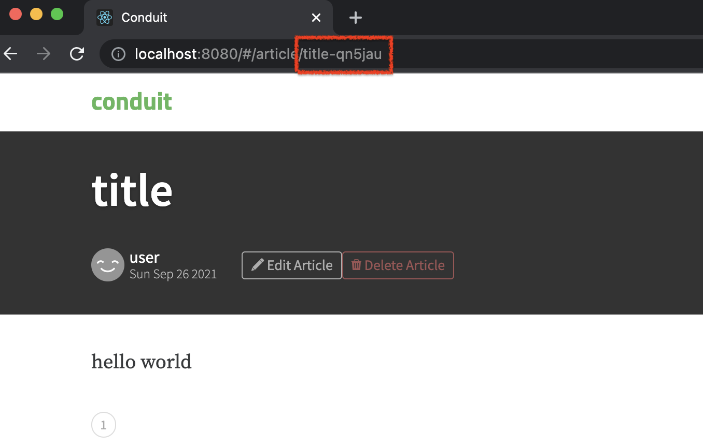
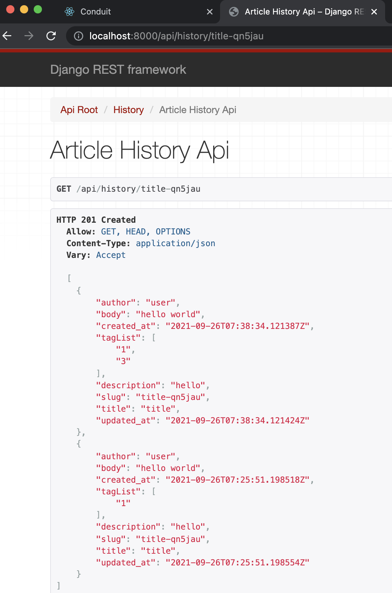

# realworld

## run

컴포즈를 빌드, 실행합니다.
```shell
$ docker-compose up -d --build
```

컨테이너가 잘 실행되는지 체크합니다.
```shell
$ docker-compose ps

        Name                      Command               State                    Ports
--------------------------------------------------------------------------------------------------------
realworld_backend_1    /bin/sh -c python manage.p ...   Up      0.0.0.0:8000->8000/tcp,:::8000->8000/tcp
realworld_db_1         /docker-entrypoint.sh postgres   Up      0.0.0.0:5432->5432/tcp,:::5432->5432/tcp
realworld_frontend_1   docker-entrypoint.sh npm start   Up      0.0.0.0:8080->8080/tcp,:::8080->8080/tcp
```

### history api 테스트 방법
1. `http://localhost:8080`으로 접속해 회원가입을 한 후, 글을 작성합니다.

2. 작성한 포스트의 slug값을 주소창에서 확인합니다


3. `http://localhost:8000/api/history/title-qn5jau` 형태로 검색하면 해당 article의 변경이력을 확인할 수 있습니다.



## containerized

frontend, backend, db 세 개의 컨테이너로 실행합니다.  
docker-compose를 이용해 한 번에 구성을 실행할 수 있습니다.

### frontend containerize

로컬에서 빌드후 완성된 build산출물만 넣어서 이미지를 만들 수도 있으나, 원 샘플을 기준으로 컨테이너 실행시 필요한 모듈을 설치하고
빌드와 동시에 실행되도록 Dockerfile을 구성하였습니다. 따라서 시간이 소요 될 수 있습니다.

node alpine 중에서도 상세 버전이 확인 가능한 아래 버전을 사용합니다.
```shell
FROM node:14.15.4-alpine3.11
```

소스들을 컨테이너로 복사합니다.
```shell
COPY . /app/frontend/
WORKDIR /app/frontend
```

컨테이너에서 노출 할 포트를 지정합니다.
```shell
EXPOSE 8080
```

컨테이너 실행시 수행 할 명령어를 지정합니다.
```shell
CMD ["npm", "start"]
```

### backend containerize

원 프로젝트는 django 1.10.x버전을 사용하고 있습니다. 권장되는 python 버전은 2.7, 3.4, 3.5 이므로 python 3.5 베이스를 가져옵니다.
```shell
FROM python:3.5
```

django에서 사용하는 postgres 정상적으로 작동하도록하는데 필요한 종속성을 설치합니다.
```shell
RUN apt-get update \
    && apt-get install -y --no-install-recommends \
        postgresql-client \
    && rm -rf /var/lib/apt/lists/*
```

소스코드를 복제하고, workdir을 지정합니다.
```shell
COPY . /app/backend/
WORKDIR /app/backend
```

필요한 패키지들을 설치합니다.
```shell
RUN pip install -r requirements.txt
```

컨테이너에서 노출 할 포트를 지정합니다. ( 과제로 추가 된 api를 테스트하기 위함입니다 )
```shell
EXPOSE 8000
```

컨테이너 실행시 수행될 명령어를 지정합니다.
```shell
CMD python manage.py migrate; python manage.py runserver 0.0.0.0:8000
```

## docker-compose 네트워크 설정

아래와 같이 세개의 브릿지로 이루어져 있습니다.
```shell
networks:
  application-network:
    driver: bridge
  database-network:
    driver: bridge
  common-network:
    driver: bridge
```

각 애플리케이션은 application-network를 사용하고, db는 database-network를 사용합니다.
backend와 db는 통신가능해야하므로 common-network를 추가로 사용할 수 있도록 했습니다.
